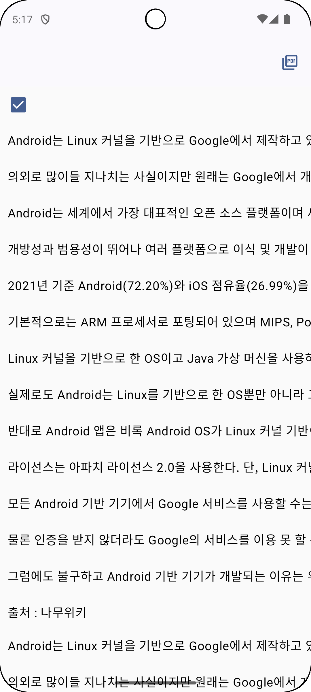
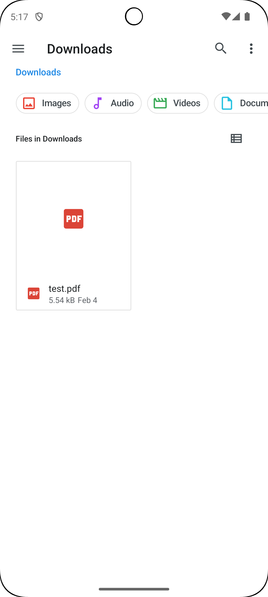
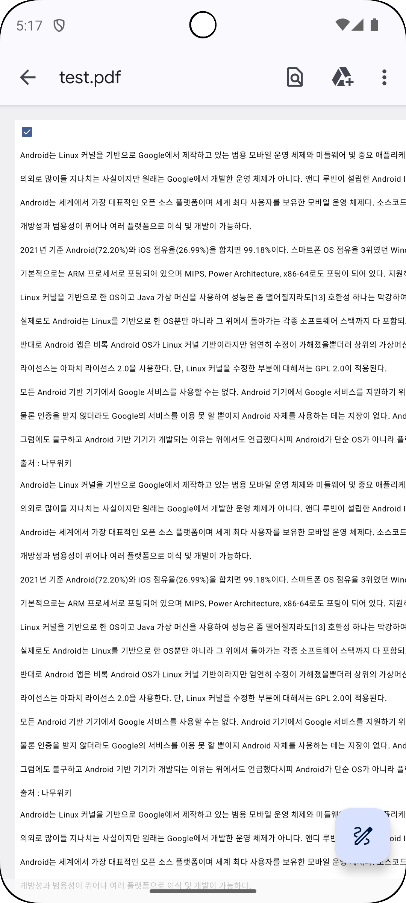

# Compose PDF Maker

You can create a screen implemented with Android Compose into a single PDF file.
It supports both horizontal and vertical scrolling, and is stored in external public storage.

| APP                                  | LOC                                  | PDF                                  |
|--------------------------------------|--------------------------------------|--------------------------------------|
|  |  |  |

## Implementation

Please update jitpack maven repository in your project build.gradle

```
dependencyResolutionManagement {
    repositoriesMode.set(RepositoriesMode.FAIL_ON_PROJECT_REPOS)
    repositories {
        mavenCentral()
        maven { url 'https://jitpack.io' }
    }
}
```

## How to use

It is simple to use. Please wrap the screen you want to convert to a PDF file with a PdfScanner block.
And please click the PDF Icon button. Then created your PDF file.
User's input is also converted to PDF like captured screen.

```
@Composable
fun SamplePage() {
    val isChecked = remember { mutableStateOf(false) }

    // Just Use PdfScanner only
    PdfScanner {
        // Write your code here like this
        // ...
        Column {
            Checkbox(
                checked = isChecked.value,
                onCheckedChange = {
                    isChecked.value = it
                }
            )
            SampleText()
            SampleText()
            SampleText()
        }
    }
}
```

## Parameters

| name                                         | description                                                                                                                                     |
|----------------------------------------------|-------------------------------------------------------------------------------------------------------------------------------------------------|
| fileName: String                             | You can enter the file name.<br>It is optional value. If you don't use, the PDF file title is "test.pdf"                                        |
| pdfHeight: Int                               | You can specify height values to implement multiple page PDF files.<br>It is optional value. If you don't use, just generate one page PDF file. |
| onClickSave: () -> Unit                      | After clicking the Create PDF file button, you can add the necessary actions.<br>It is optional value.                                          |
| dropDownActionButton: @Composable () -> Unit | You can add action buttons in PdfScanner Appbar<br>It is optional value.                                                                        |
| content: @Composable () -> Unit              | Screen or Content for PDF File Generation. Must be declared.                                                                                    |

## License

```
MIT License

Copyright (c) 2025 GOLD

Permission is hereby granted, free of charge, to any person obtaining a copy
of this software and associated documentation files (the "Software"), to deal
in the Software without restriction, including without limitation the rights
to use, copy, modify, merge, publish, distribute, sublicense, and/or sell
copies of the Software, and to permit persons to whom the Software is
furnished to do so, subject to the following conditions:

The above copyright notice and this permission notice shall be included in all
copies or substantial portions of the Software.

THE SOFTWARE IS PROVIDED "AS IS", WITHOUT WARRANTY OF ANY KIND, EXPRESS OR
IMPLIED, INCLUDING BUT NOT LIMITED TO THE WARRANTIES OF MERCHANTABILITY,
FITNESS FOR A PARTICULAR PURPOSE AND NONINFRINGEMENT. IN NO EVENT SHALL THE
AUTHORS OR COPYRIGHT HOLDERS BE LIABLE FOR ANY CLAIM, DAMAGES OR OTHER
LIABILITY, WHETHER IN AN ACTION OF CONTRACT, TORT OR OTHERWISE, ARISING FROM,
OUT OF OR IN CONNECTION WITH THE SOFTWARE OR THE USE OR OTHER DEALINGS IN THE
SOFTWARE.
```